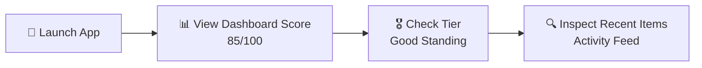
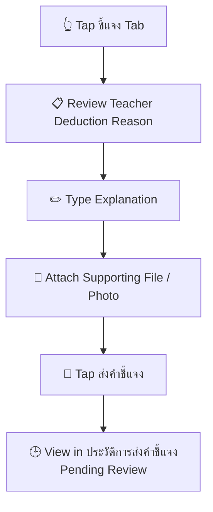
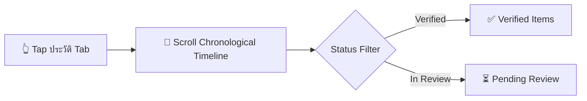
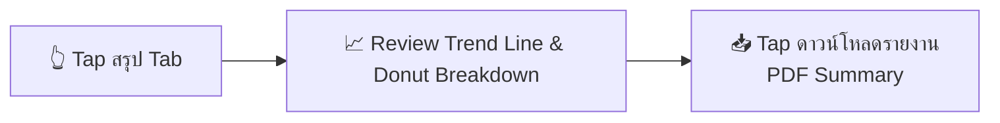

# Prototype Overview

## Mobile App Information Architecture (IA) & User Journeys

จากการสังเคราะห์ Pain Points และ HMW ทีมได้ออกแบบสถาปัตยกรรมข้อมูล และ User Journeys 

 สำหรับแอปพลิเคชันระบบจัดการและอุทธรณ์คะแนนความประพฤติ/กฎระเบียบดิจิทัล เพื่อความโปร่งใสและสร้างพื้นที่ชี้แจงอย่างเป็นธรรม

### Core Navigation Structure 
- **หน้าหลัก** คะแนนความประพฤติปัจจุบัน, Tier สถานะ, กิจกรรมล่าสุด
- **ชี้แจง:** ตรวจสอบรายการหักคะแนน, ส่งคำชี้แจงพร้อมหลักฐาน, ติดตามผลการพิจารณา
- **History** ไทม์ไลน์บันทึกพฤติกรรมย้อนหลัง 
- **Summary** กราฟแนวโน้มพฤติกรรม, สัดส่วนคะแนนตามหมวดหมู่, ส่งออกรายงานประจำเทอม

---

### Key User Journeys

#### 🔄 Journey 1: การตรวจสอบสถานะประจำวัน
ผู้ใช้ตรวจสอบสถานะคะแนนความประพฤติและระดับ Tier ทันทีหลังเปิดแอป เพื่อความอุ่นใจและรับรู้สถานะตนเอง

- **Thumb Zone Action:** การ์ดคะแนนหลักด้านบน มองเห็นได้ชัดเจนตั้งแต่หน้าแรก
- **UX Outcome:** ลดความกังวล  ด้วยข้อมูลที่โปร่งใสและอัปเดตแบบเรียลไทม์

---

#### ⚖️ Journey 2: การส่งคำชี้แจงและอุทธรณ์เหตุการณ์
เมื่อถูกตัดคะแนนจากเหตุสุดวิสัย เช่น วิ่งเปลี่ยนคาบพละ หรือเหตุเข้าใจผิด นักเรียนสามารถส่งคำอธิบายพร้อมหลักฐานเชิงประจักษ์ได้ทันที

- **Restorative Design:** เปลี่ยนระบบการลงโทษทางเดียวเป็นการสื่อสารสองทาง 
- **Peak Moment:** การยืนยันสถานะ "ส่งคำชี้แจงสำเร็จ" พร้อมข้อความให้กำลังใจและกรอบเวลาตอบกลับของอาจารย์

---

#### 📜 Journey 3: การตรวจสอบไทม์ไลน์ประวัติย้อนหลัง
การตรวจสอบรายการบันทึกคะแนนย้อนหลังอย่างละเอียด เพื่อให้มั่นใจในความถูกต้องของข้อมูล

- **Visual Clarity:** แยกสถานะด้วย Color Badge ที่ชัดเจน (เขียว = รับรองแล้ว, ส้ม = กำลังพิจารณา)

---

#### 📈 Journey 4: การวิเคราะห์แนวโน้มและดาวน์โหลดรายงานประจำเทอม
*สรุปภาพรวมพฤติกรรมตลอดภาคเรียนเพื่อนำไปใช้วางแผนปรับปรุงตนเอง หรือยื่นขอเอกสารรับรอง*

- **Data Visualization:** กราฟวงโดนัท  แสดงสัดส่วนตามหมวดหมู่กฎ และเส้นแนวโน้มคะแนน  สนับสนุนการฟื้นฟูพฤติกรรมระยะยาว

## 🔗 Related Notes in Car Park House
- [[00 - Car Park House (Dashboard)|Master Dashboard (Control Tower)]]
- [[Interview Script (School Rules)|Complete Interview Transcript (Raw Script)]]
- [[computationalThinking|Computational Thinking Rubric & Decomposition]]
- [[KMUTT_Project|Copilot 365 Assistant for SIT Students]]
- [[User Persona (Phum)|Phum's Persona in Living Quarters]]

📌 **[สรุป I Wish Feedback & ความเห็นทีม]**

* **Feedback:** อยากให้เข้าผ่านเว็บได้ด้วย จะได้ไม่ต้องดาวน์โหลดแอป
* **Team Note:** `idk` / `interesting`

* **Feedback:** อยากให้ปรับปรุง UI ให้ละมุนขึ้น UI ยังดูแข็งๆ อยู่
* **Team Note:** `Already have`

* **Feedback:** อยากให้แนบรูป/เอกสารหลักฐานโต้แย้งได้ ไม่ใช่ตัดสินจากการดูของอาจารย์อย่างเดียว
* **Team Note:** `About Presentation`

* **Feedback:** ประชาสัมพันธ์กิจกรรมเพื่อบวกคะแนน
* **Team Note:** `Not good`

* **Feedback:** Journey map เยอะ และเข้าใจยากนิดนึง อยากให้กระชับขึ้น
* **Team Note:** `interesting`

* **Feedback:** เพิ่ม Leaderboard และมอบรางวัลให้นักเรียนคะแนนประพฤติดีเพื่อสร้างแรงจูงใจ
* **Team Note:** `interesting`

**7. การประชาสัมพันธ์ระบบเดิม**
* **Feedback:** มีระบบเดิมอยู่แล้วหลายจุด แต่เด็กไม่เข้าไปใช้ อยากให้เพิ่มการประชาสัมพันธ์

**8. แจ้งเตือน / แสดงระดับคะแนน / ข้อมูลโปรไฟล์**
* **Feedback:**
  * คะแนนพฤติกรรมไม่มีแจ้งลงโทรศัพท์ชัดเจน (เช่น กรณีต่ำกว่า 80)
  * ระดับคะแนนอาจไม่จำเป็น เพราะมีระบบคะแนนความประพฤติอยู่แล้วและไม่มีสิทธิพิเศษ
  * อยากให้ติดเบอร์ผู้ปกครองไว้ที่หน้าโปรไฟล์นักเรียน
* **Team Note:** `Confusing Review`

---
