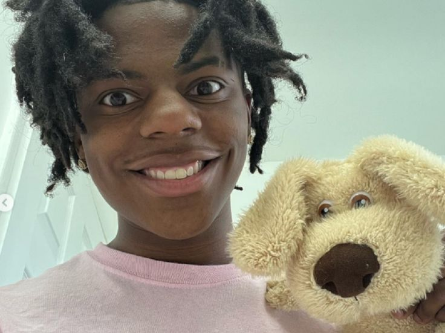
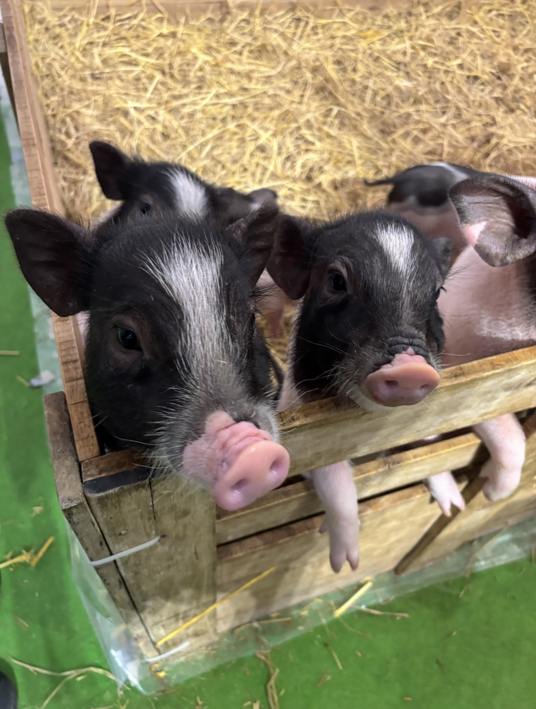
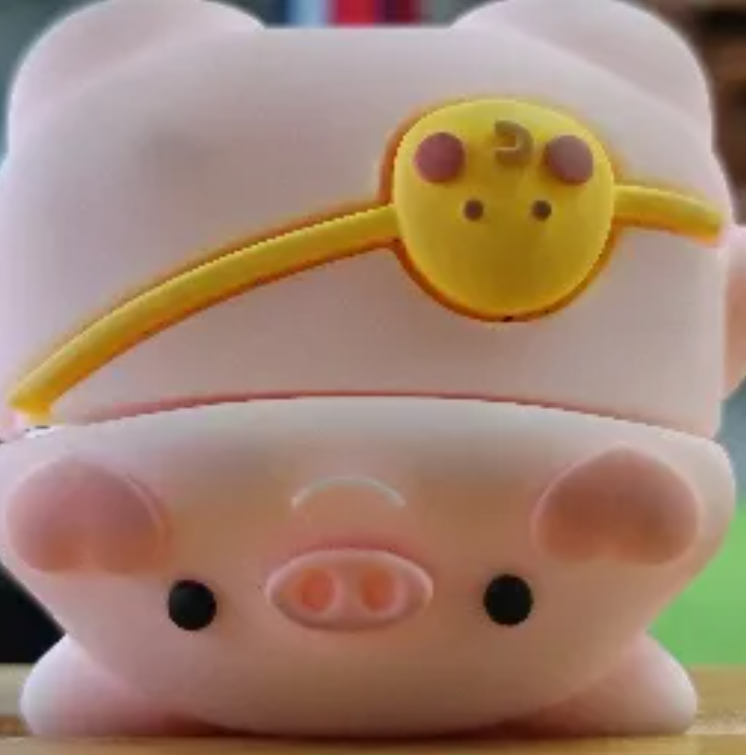

TEAM NAME : 
Reasons :

# 1.Profile Introduce

### Personal Details

* **First name - Surname:** นายกรกฎ สอนชิต
* **Age:** 19 ปี
* **Birth Date:** 16 กรกฎาคม 2007
> Git hub link : https://github.com/Korakod00
---

### Hobby & Why?

* **ฟังเพลง & เล่นเกม:** ชอบเพราะช่วยให้รู้สึกผ่อนคลายและสนุกสนาน
* **เขียนโค้ด:** ชอบเพราะอยากพัฒนาตัวเองอยู่ตลอดเวลา

---

### Quote & Why?

ขอแค่ได้ลงมือทำ สิ่งนั้นจะเป็นก้าวเล็กๆ ที่พาไปสู่ความสำเร็จ

> : รู้ว่าการจะทำอะไรสักอย่างให้ประสบความสำเร็จต้องใช้เวลาสะสมและบ่มเพาะ แต่เมื่อถึงจุดที่ความพยายามสุกงอม ตอนนั้นแหละที่เราจะได้เห็นความรู้และความสำเร็จทั้งหมดที่เก็บสะสมมา

---

### Favorite Food & Why?

ต้มยำกุ้ง
>: เป็นเมนูโปรดเพราะเป็นอาหารที่แม่ทำให้กินมาตั้งแต่เด็กๆ

---

## ❓ Q&A

#### **Q: ช่วงมัธยมปลายเรียนสายอะไรมา & เพราะอะไรถึงเลือกสายนี้?**

> **A:** เรียนสาย **วิทย์ - คณิต** ครับ เพราะรู้สึกว่าสายนี้สามารถต่อยอดและเข้าศึกษาต่อได้หลากหลายคณะ

#### **Q: Why did you choose SIT at KMUTT?**

> **A:** เริ่มจากการได้มีโอกาสเข้าค่ายด้าน IT บ่อยๆ ประกอบกับมหาวิทยาลัยอยู่ใกล้บ้าน และเปิดสอนคณะเทคโนโลยีสารสนเทศโดยตรง อีกทั้งในวันสัมภาษณ์ได้พบกับอาจารย์แล้วรู้สึกว่าอาจารย์ใจดีและเป็นกันเองมากๆ จึงตัดสินใจเลือกเข้าศึกษาต่อที่ SIT KMUTT

#### **Q: ที่มาของโปรไฟล์ Discord & Why?**

> **A:** 
> ชอบรูปนี้เพราะให้ความรู้สึกถึงความอบอุ่นครับ

---
# 2.Personal Information

## **👋 Basic Information** ##
**First name & Surname :** นายภูวณัฏฐ์ รุจิราธัญวัฒน์

**age :**
19

**birth date :**
19 กรกฎาคม 2007

 **GitHub**
https://github.com/puwanat4

---

### **🏈 hobby & why?**

***เล่นบอลเพราะว่ารู้สึกสนุกทุกครั้งที่ได้เล่น , ชอบเขียนโค้ดเพราะอยากพัฒนาตัวเอง***

---

### **🚶‍♂️ quote (คติ, คำพูดที่ชอบ) & why?**
--> ***"The people who are crazy enoughto think they can change the world are the ones who do. (Steve Jobs)"***
 ชอบเพราะความฝันของเราไม่ได้ใหญ่เกินไป และความแปลกของเราไม่ได้ไร้สาระ

---

### **🍖 favorite food & why?**
กะเพราหมูสับไข่ดาว ชอบเพราะเป็นอาหารที่แม่ทำอร่อยที่สุด

---

# Questions
1. **ช่วงมัธยมปลายเรียนสายอะไรมา & เพราะอะไรถึงเลือกสายนี้**
    
    > วิทย์-คณิต เพราะรู้สึกว่าเอาไปต่อยอดในสายไอทีได้

2. **Why did you choose SIT at KMUTT? & why?**
    
    > เลือก SIT เพราะว่าส่วนตัวมีความสนใจด้านไอทีอยู่แล้วตั้งแต่มอปลาย และได้เห็นรุ่นพี่กับคุณครูที่จบจาก SIT ไปเป็นบุคลาการที่ดีและที่นี้ป็นมหาวิทยาลัยชั้นนำ

3. **ที่มาของโปรไฟล์ discord & why? แนบรูปมาด้วย**
    > ชอบหมูน่ารัก
    
---

# 3.USER INTERVIEW

## 👤 ข้อมูลทั่วไป

**ชื่อจริง & นามสกุล:** ภูมิพัฒน์ ขัดนันตา
**อายุ:** 18 ปี 5 เดือน  
**วันเกิด:** 12 มีนาคม 2551  
**สถานะ:** นักศึกษามหาวิทยาลัย
**Github Link**: https://github.com/phumxstarr   

### ที่มาของชื่อ

ครอบครัวตั้งชื่อ “ภูมิ” เพราะมีความหมายใกล้เคียงกับชื่อจริง และมีความหมายในภาษาไทยว่า **“ผู้เป็นใหญ่ในแผ่นดิน”**

---

## 🧠 คติประจำใจ

> “ไม่มีอะไรยากกว่าการไม่ลงมือทำ เพราะสิ่งที่ยากที่สุดคือการเริ่มลงมือทำ ถ้าเราลงมือทำ ก็จะเจอทางออกเสมอ”

**เหตุการณ์จริงที่เกิดขึ้น:**  
เคยไม่กล้าทำ Project เพราะกลัวว่าจะเจอ Error แล้วไม่สามารถแก้ไขได้ ทำให้เห็นว่าปัญหาที่ใหญ่ที่สุดอาจไม่ใช่ Error แต่คือการไม่เริ่มลงมือทำ

---

## 🏸 งานอดิเรก

### แบดมินตัน

ชอบแบดมินตันเพราะเป็นกีฬาที่ **สนุกและต้องเคลื่อนไหวอยู่ตลอดเวลา** อีกทั้งยังได้ใช้การคิดวิเคราะห์ว่าจะตีลูกแบบไหน ตีไปตำแหน่งใด เพื่อสร้างความได้เปรียบ

### การฟังเพลง

ฟังเพลงได้เกือบทุกแนว แต่ไม่ค่อยชอบเพลงไทยเดิมและเพลงลูกกรุง เพราะรู้สึกว่าไม่ค่อยเข้ากับความชอบของตัวเอง

**เพลงที่ชอบ**

- เธอไม่ได้สอนให้ฉันอยู่คนเดียว
    
- ลาจากตรงนี้ที่(เคย)สวยงาม
    
- เมื่อไหร่จะบอก
    

**เพลงที่เลือกฟังได้ตลอดชีวิต:**  
“บรรยากาศ” — OnlyMonday

---

## 🍜 อาหาร

### ❤️ อาหารโปรด

**ต้มยำกระดูกหมู**  
เป็นอาหารที่ยายทำให้กินตั้งแต่เด็ก จึงมีความผูกพัน นอกจากนั้นยังชอบรสชาติที่มีความเปรี้ยวนำ ตามด้วยเค็ม และมีหวานเล็กน้อยเมื่อกินกับข้าวสวย

**ข้าวไข่ข้น**  
เป็นเมนูที่ชอบเพราะ **ทำง่าย ทำได้แทบทุกที่ที่มีครัว และสามารถปรับรสชาติได้ตามคนปรุง**

> ถ้าต้องเลือกอาหารเพียงหนึ่งเมนูเพื่อกินทุกวัน จะเลือก “ข้าวไข่ข้น”

### ❌ อาหารที่ไม่ชอบ

**ไข่พะโล้ และไข่ลูกเขย**

เหตุผลหลักคือไม่ชอบอาหารที่มี **รสชาติหวานนำ** เพราะมองว่าแกงหรืออาหารคาวควรมีรสชาติอื่นมากกว่าความหวาน

อีกเหตุผลหนึ่งคือสมัยเด็กกินอาหารประเภทนี้บ่อย จึงทำให้รู้สึกเบื่อ

---

# 🎓 สายการเรียน

**วิทยาการคอมพิวเตอร์**

### สิ่งที่เรียน

- การเขียนโปรแกรม
    
- วิชาสามัญ
    
- งาน Production
    
    - การทำ MV
        
    - การทำหนังสั้น
        
    - การทำสื่อในรูปแบบต่าง ๆ
        

โดยเป็นการเรียนวิชาพื้นฐานร่วมกับห้องเรียนทั่วไป และไม่ได้แยกวิชาวิทยาศาสตร์อย่างฟิสิกส์ เคมี และชีววิทยาออกมาเหมือนสายวิทยาศาสตร์ทั่วไป

### ทำไมถึงเลือกเรียนสายนี้?

เดิมทีครอบครัวต้องการให้เรียนแผนการเรียนวิทย์-คณิต แต่เกรดไม่ถึงเกณฑ์ จึงได้มาเรียนสายวิทยาการคอมพิวเตอร์แทน

นอกจากนี้ ตั้งแต่เด็กภูมิมีความสนใจเกี่ยวกับคอมพิวเตอร์อยู่แล้ว เพราะเคยมีประสบการณ์ทำ **Presentation โดยใช้คอมพิวเตอร์เป็นสื่อการนำเสนอ**

ประสบการณ์นั้นทำให้เกิดคำถามว่า

> “คอมพิวเตอร์สามารถนำไปประกอบอาชีพอะไรได้บ้าง?”

จึงเริ่มสนใจและอยากเรียนรู้ด้านนี้มากขึ้น

---

# 🏫 Why SIT @ KMUTT?

ช่วงแรกภูมิ **ยังไม่รู้จัก SIT มาก่อน** แต่ได้พบกับกิจกรรม **SIT Open House** จึงลองเข้ามาทำความรู้จักกับคณะ

อีกหนึ่งเหตุผลคือ **มีเพื่อนชวนมา**

หลังจากได้เข้าร่วม Workshop ของคณะ ทำให้รู้สึกว่ารูปแบบการเรียนตรงกับสิ่งที่ตัวเองเคยเรียนมา โดยเฉพาะด้านการเขียนโปรแกรม

### จุดเริ่มต้นจาก Portfolio

ตอน ม.4 เทอม 2 ครูให้ทำ Portfolio จำลองเพื่อส่งในวิชาแนะแนว

ภูมิเลือกใช้ **SIT เป็นต้นแบบของ Portfolio**

จากนั้นจึงนำประสบการณ์และผลงานที่ทำไว้ในตอนนั้นมาต่อยอดเป็น Portfolio จริงสำหรับสมัครเข้า SIT

---

# 💡 Why does he like SIT?

สิ่งที่ภูมิชอบเกี่ยวกับ SIT ได้แก่

**1. มีสายการเรียนให้เลือกหลากหลาย**  
โดยเฉพาะเมื่อขึ้นปี 2 ทำให้สามารถเลือกเส้นทางที่ตรงกับความสนใจของตัวเองได้มากขึ้น

**2. เป็นคณะที่มีความทันสมัย**  
รู้สึกว่าเนื้อหาและรูปแบบการเรียนมีความใกล้เคียงกับโลกเทคโนโลยีจริง

**3. Learning Experience ตรงกับตัวเอง**  
มีทั้งการเขียนโปรแกรม การทำ Project และ Workshop ซึ่งเป็นรูปแบบการเรียนที่รู้สึกสนุก

### หลังจากเข้ามาเรียนจริง

> **“รู้สึก Happy และสนุกกับการเรียน”**

---

# 🌐 Digital Identity

## Discord Profile

### ที่มาของรูป

ตอนนั้นเป็นเพียงแค่ถ่ายรูปเล่น ๆ

หลังจากนั้นเมื่อเลือกดูรูปใน Gallery ก็ไปเจอรูปนี้ จึงนำมาใช้เป็น Profile Picture

### แล้วทำไมต้องเป็น “รูปหมู”?

เป็นสิ่งที่เกิดจากการเลือกภาพที่มีอยู่ใน Gallery มากกว่าจะเป็นการวาง Identity อย่างจริงจัง

**สะท้อนลักษณะของผู้ใช้:**  
ไม่ได้ให้ความสำคัญกับการสร้างภาพลักษณ์ออนไลน์แบบเป็นทางการมากนัก แต่เลือกสิ่งที่ **รู้สึกใช่หรือหยิบใช้ได้ในตอนนั้น**

---

หมายเหตุ: ใช้ GPT 5.6 Luna ช่วยในการจัดหน้า markdown 

---
# 4. INTERVIEW PROFILE

## 01 — COMMON INFORMATION

**Fristname Surname**
**กาญจนวัฒน์ ขนาบแก้ว**

ชื่อ “กาญจนวัฒน์” มีความหมายที่น่าสนใจ
**กาญจน์** หมายถึง *ทอง* ส่วน **วัฒน์** สื่อถึง *ความเจริญและการพัฒนา* ซึ่งเป็นความหมายที่ผมรู้สึกว่าดี เพราะการพัฒนาตัวเองก็เป็นสิ่งที่ผมให้ความสำคัญ

**Age:** 19 years 1 month
**Birth Date:** 4 July 2007
**Github** https://github.com/SymBab

---

# 02 — MY INTERESTS

### 📷 Photography

ผมชอบถ่ายภาพเพราะเป็นคนที่ชอบสังเกตสิ่งรอบตัว หลายครั้งสิ่งธรรมดาที่เราเห็นทุกวันอาจมีมุมที่สวยงาม เพียงแค่เราลองมองมันในมุมที่ต่างออกไป

สำหรับผม **Photography คือการเก็บ Moment** ที่อาจเกิดขึ้นเพียงครั้งเดียว ให้สามารถกลับมาดูและรู้สึกถึงช่วงเวลานั้นได้อีกครั้ง

### 🎥 Video

บางความรู้สึกไม่สามารถถ่ายทอดผ่านภาพนิ่งได้ทั้งหมด
ภาพเคลื่อนไหวจึงเป็นอีกวิธีหนึ่งที่ช่วยเก็บทั้งบรรยากาศ การเคลื่อนไหว และรายละเอียดของความรู้สึกใน Moment นั้นเอาไว้

### 🎬 Assistant Cinematographer

ผมเป็นคนชอบดูหนัง ทำให้มักสังเกตมุมกล้อง แสง และองค์ประกอบต่าง ๆ จนมีมุมภาพหลายแบบอยู่ในหัว

เวลาได้ทำงาน Production เพื่อน ๆ มักจะให้ผมช่วยดูว่า **มุมไหนสามารถถ่ายทอดอารมณ์ของฉากนั้นออกมาได้ดีที่สุด**

### ✂️ Editor

ผมมองว่าการตัดต่อเหมือนการเป็น **“นักเล่นแร่แปรธาตุ”**

เพราะเราสามารถนำภาพ แสง สี เสียง และจังหวะต่าง ๆ มาควบคุมและผสมกัน เพื่อเปลี่ยนอารมณ์ของงานได้ การได้เห็นสิ่งที่เราคิดค่อย ๆ กลายเป็นผลงานจริงผ่านโปรแกรมตัดต่อ จึงเป็นสิ่งที่ผมรู้สึกสนุกมาก

---

# 03 — MY QUOTE

> **“ไม่ว่าจะเจอสถานการณ์แบบไหน ไม่ว่าจะดีหรือร้าย อย่างน้อยเราจะมีบางสิ่งที่ได้เรียนรู้ และนำไปพัฒนาตัวเองต่อได้เสมอ”**

ผมชอบคำพูดนี้เพราะคิดว่า **ทุกประสบการณ์มีบางอย่างให้เราเรียนรู้** ไม่ว่าจะเป็นความสำเร็จหรือความผิดพลาด

และเพราะเวลาของเรามีจำกัด ผมจึงคิดว่าเราไม่ควรปล่อยให้เวลาผ่านไปโดยเปล่าประโยชน์ แต่ควรใช้ทุกเหตุการณ์เป็นโอกาสในการพัฒนาตัวเอง

---

# 04 — MY FAVORITES

### 🍳 Favorite Food

**ข้าวผัดเครื่องแกงหมูกรอบพิเศษ + ไข่เจียวหมูสับ**

เหตุผลง่าย ๆ คือ **ถูกปาก และกินได้ทุกวัน**

### 🌶️ Not My Favorite

**ส้มตำใส่ถั่วฝักยาว**

เพราะผมรู้สึกว่าถั่วฝักยาวมีรสชาติขม เลยไม่ค่อยชอบกิน

---

# 05 — HIGH SCHOOL LIFE

### 🎓 MSET Program

ช่วงมัธยมปลาย ผมเรียนใน **โครงการวิทย์-คอม MSET**

ที่เลือกสายนี้เพราะเป็นโครงการที่เน้นด้าน **Technology** ซึ่งตรงกับความสนใจของผม นอกจากนี้ยังมีรุ่นพี่ที่เข้าร่วมการแข่งขันและกิจกรรมต่าง ๆ อยู่บ่อย ๆ

ผมจึงมองว่านอกจากจะได้เรียนรู้ด้านเทคโนโลยีแล้ว ยังมีโอกาสได้เจอเพื่อนที่มี **ความสนใจและเป้าหมายคล้ายกัน**

---

# 06 — WHY SIT @ KMUTT?

เหตุผลที่ผมเลือก **SIT ที่ KMUTT** มีจุดเริ่มต้นที่ค่อนข้างแปลกนิดหนึ่ง

ประมาณ **1 สัปดาห์ก่อนสมัคร ผมฝันว่าตัวเองสอบติด SIT**

จากนั้นจึงเริ่มลองศึกษาข้อมูลของ SIT มากขึ้น และพบว่าที่นี่มีสายการเรียนให้เลือกค่อนข้างหลากหลาย

ในตอนนั้นผมเองยังไม่แน่ใจว่าอนาคตอยากทำงานอะไร การที่ SIT มีหลายเส้นทางให้เลือก จึงทำให้ผมรู้สึกว่า **ที่นี่น่าจะเป็นพื้นที่ที่ช่วยให้ผมค้นหาสิ่งที่ตัวเองชอบ และพัฒนาตัวเองต่อไปได้**

---

# 07 — MY DISCORD PROFILE

### 🌅 Profile Picture

ผมเลือกใช้รูปวิวเพราะชอบภาพที่ดูสวยและสบายตา และรู้สึกว่าภาพวิวสามารถสะท้อนความชอบด้าน Photography ของผมได้ด้วย

### 🍂 Username

  **autumn**

เหตุผลที่ใช้ชื่อ **“autumn”** เพราะผมชอบบรรยากาศของฤดูใบไม้ร่วง และรู้สึกว่าชื่อนี้มีความเรียบง่าย แต่ยังมีเอกลักษณ์

อีกเหตุผลหนึ่งที่ใช้ Discord คือผมอยาก **ทำความรู้จักและพูดคุยกับเพื่อนต่างชาติ** มากขึ้น จึงเลือกโปรไฟล์ที่เป็นตัวแทนความชอบของตัวเองแบบเรียบง่าย

> **“บางครั้งแค่ภาพหนึ่งภาพ ก็สามารถบอกความเป็นตัวเราได้มากกว่าคำพูด”**
---
หมายเหตุ: ใช้ ChatGPT ช่วยในส่วนของการเรียบเรียงตัวอักษร และ จัดหน้า Markdown

---

# 5.Interview 

### **Nickname \& Surname**

ชื่อ ทรีโชติ ฝ่ายดี ชื่อเล่น มิก 

GITHUB : https://github.com/Teerachot41001

### **age** 
อายุ 19

### **birth date**

14/07/2550

### **hobby \& why?**

เวลาว่างชอบนั่งดูการ์ตูน สมัยเด็กแม่มิกชอบเปิดทีวีให้ดู แล้วมันก็จะมีช่องการ์ตูนทำให้ตอนนั้นชอบดูการ์ตูนจนมาถึงปัจุบัน 
ช่วงนี้ดูการ์ตูนจากเน็ตฟริกชอบการ์ตูนโชนิน/ต่อสู้
- ดาบพิฆาตอสูร
- เชนซอแมน

### **quote (คติ, คำพูดที่ชอบ) \& why?**

คติประจำใจคือ มันมีวันพรุ่งนี้เสมอ รู้สึกว่าไม่ว่าจะเจอเรื่องท้อแค่ไหน ให้เราตั้งสติลองมองอดีตแล้วทำมาปรับปรุงเราก็สาสามารถที่จะหาทางแก้แล้วมองไปยังอนาคตได้
ใช้ได้กับ
- เรื่องส่วนตัว
- เรื่องงาน

### **favorite food \& why?**

ชอบกินกระเพราหมูกรอบ เวลาไปร้านอาหารตามสั่งก็จะสั่งตลอดเพราะมันกินง่าย อร่อยด้วย ทุกร้านตามสั่งจะมีสามารถที่จะเดินๆไปแล้วบอกแม่ค่าว่าเอาอันนี้แหละ

# **Questions**

### **ช่วงมัธยมปลายเรียนสายอะไรมา \& เพราะอะไรถึงเลือกสายนี้**

จบจากวิทคณิต เพราะว่าเรียนวิทคณิตมาตั้งแต่มอต้นอยู่แล้วเป็นทุนเดิม มันมีความคุ้นเคยคุ้นชินกับการเรียนสายนี้เลยเลือกเรียนสายนี้ต่อช่วงมอปลาย

### **Why did you choose SIT at KMUTT? \& why?**

จริงๆอยากเรยนวิศวะคอม เป็นคนที่ถนัดคณิต ฟิสิก แต่พอเข้ารอบ 3 คะแนนมันไม่ถึงเลยเลือกคณะนี้ มีความอยากเข้าพระจอมตั้งแต่แรกอยู่แล้ว พระจอมก็จะมีความเด่นเรื่องเทคโนโลยีเลยคิดว่าตัวเองจะเหมาะกับที่นี้มากที่สุด

### **Why use this discord profile? แนบรูปมาด้วย**

ที่ใช้โปรไฟล์นี้เพราะเป็นนางเอกของซีรีสเกลาหลีมธยมซอมบี้ เป็นคนที่ชอบดาราคนนี้ แสดงดี เก่ง น่ารักเลยใช้มาตั้งแต่มอต้น กำลังติดตามซีซันต่อไปอยู่เนื้อเรื่องเข้มข้มดี

